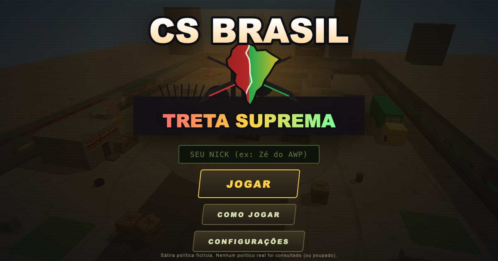

# CS BRASIL: Treta Suprema

[](https://www.kimi.com/)
[](LICENSE)
[](https://vercel.com)
[](https://astro.build)



FPS de navegador em Three.js: arena de sniper estilo CS 1.6 (`awp_map`) em uma Brasília
fictícia e satírica. Personagens 100% fictícios, sem gore — só arquétipos exagerados.

> 📝 Este jogo foi gerado do zero por IA (Kimi K3) a partir de um único prompt —
> [leia o prompt original em PROMPT.md](PROMPT.md).

## Arquitetura

Monorepo com duas zonas:

- **Jogo** (`public/game/`) — vanilla JS + Three.js vendored, **zero build**:
  roda sozinho com qualquer servidor estático. Nunca vira framework.
- **Site** (raiz, [Astro](https://astro.build)) — landing `/`, `/personagens`,
  `/como-jogar` (SEO/AEO real) + **API routes SSR** (`/api/*`) pro ranking
  global: a `service_role` key do Supabase fica no servidor, nunca no browser.

## Rodar localmente

Só o jogo (zero dependências):

```bash
cd public/game
python3 -m http.server 8123
# abra http://localhost:8123
```

Site completo (landing + jogo em `/game/` + API):

```bash
git clone https://github.com/rubenmarcus/csbrasil.git
cd csbrasil
npm install
npm run fetch-audio   # pacote de áudio (opcional — sem ele roda com sons sintetizados)
npm run dev           # dev server Astro
npm run build         # gera dist/ (client + server)
npm run preview       # serve dist/client estaticamente
```

## Controles

| Tecla | Ação |
| --- | --- |
| W A S D | Mover |
| Mouse | Mirar |
| Shift | Correr |
| **Ctrl ou C** | **Agachar — mira mais estável** |
| Espaço | Pular |
| Clique esq. | Atirar |
| Clique dir. | Luneta da AWP |
| R | Recarregar |
| 1 / 2 / 3 | AWP / Pistola / Faca |
| **Z / X / V** | **Rádio estilo CS (comandos de voz)** |
| Tab | Placar |
| Esc | Pausar |

**Regras:** 4×4 com respawn (2,5s). Round de 1:39; o time com mais abates leva o round;
vence quem levar 3 rounds. AWP mata com 1 tiro; headshot tem som próprio. Multikills
disparam anúncios estilo Unreal Tournament. Defina seu **nick** no menu principal
(fica salvo, com stats locais na tela RANKING).

## Áudios (pasta `public/game/audio/`)

O jogo carrega `audio/manifest.json`:

```
audio/
  manifest.json        # mapa de faixas (edite ao adicionar arquivos)
  petista/ingame/      # falas do time P (rádio + celebração de kill)
  petista/round/       # toca quando o time P vence o round
  bolsonaro/ingame/    # falas do time B
  bolsonaro/round/     # toca quando o time B vence o round
  game/                # anúncios UT + sons de arma (awp, usp, faca, clipes)
  cs/                  # OPCIONAL: drop-in de sons próprios (ver LEIA-ME.txt)
  manifest.example.json  # manifest de referência (versionado no git)
```

- **Kill/death:** ao matar, toca fala aleatória do time do matador (throttle de 3,5s).
- **Rádio (Z/X/V + 1-3):** toca fala aleatória do seu time e mostra a linha no HUD.
- **Fim de round:** toca a faixa `round/` do time vencedor.
- **Multikill do jogador:** `doublekill` (2), `triplekill` (3), `multikill` (4),
  `megakill` (5), `godlike` (6+); 5 kills sem morrer = `killingspree`;
  headshot = `headshot`.
- **Adicionar faixas:** copie o arquivo para a pasta e registre o caminho em
  `audio/manifest.json` (mesmas chaves). Sem manifest, o jogo usa sons sintetizados.

### Pacote de áudio (open source)

A pasta `audio/` **não é versionada** (`.gitignore`) porque as vozes/memes têm
direitos incertos — o repositório público leva só o código (MIT). Para obter
o pacote:

```bash
# com a env AUDIO_PACK_URL apontando pro zip (default: Release audio-pack-v1 deste repo)
bash scripts/fetch-audio.sh
```

- **Contribuidores**: rodam o script (ou montam a própria pasta seguindo
  `manifest.example.json`). Sem os arquivos, o jogo usa sons sintetizados.
- **Criar/atualizar o pacote**: `cd public/game/audio && zip -r ../../../../audio-pack.zip . -x '*.DS_Store'`

### Sobre sons "reais" do CS 1.6

Um som de AWP estilo CS 1.6 já está configurado (`audio/game/awp-cs-1-6.mp3`).
Os samples originais do CS 1.6 são **propriedade da Valve** e não são distribuídos com
este jogo. Se você possui o jogo legalmente, pode usar seus próprios arquivos: copie de
`cstrike/sound/` para `audio/cs/` e registre no manifest, chave `"cs"`.

## Ranking global (Supabase)

- **Fase 1 (atual):** nick + link social e stats no `localStorage` (tela RANKING no jogo).
- **Fase 2:** schema pronto em `supabase/schema.sql` (players com token UUID, RPC
  `register_player`/`submit_match`, RLS, rate limit, view `leaderboard`).
  Os endpoints SSR `GET /api/leaderboard` e `POST /api/submit-match` já estão no
  site — sobem quando as envs `SUPABASE_URL` + `SUPABASE_SERVICE_ROLE_KEY`
  (só no servidor!) forem configuradas no projeto da Vercel.
- **Fase 3 (futuro):** Supabase Auth (magic link / OAuth) substitui o token local.

## SEO / AEO

Landing Astro com meta/OG/canonical + JSON-LD `VideoGame`, FAQ visível,
`robots.txt`, `sitemap.xml` e `llms.txt` em `public/`. O jogo (`/game/`) tem
seu próprio head otimizado + JSON-LD `FAQPage`.

## Estrutura

```
astro.config.mjs    Astro 7 + adapter Vercel (SSR endpoints)
vercel.json         build (fetch-audio + astro build) + cache headers
src/
  layouts/Layout.astro   shell (nav, footer, CSS global)
  pages/index.astro      landing (hero, FAQ, JSON-LD)
  pages/personagens.astro
  pages/como-jogar.astro
  pages/api/leaderboard.ts    GET ranking (service key no servidor)
  pages/api/submit-match.ts   POST partida (rate limit por IP + RPC)
  lib/supabase.ts        client admin (envs SUPABASE_URL/SERVICE_ROLE_KEY)
public/
  game/               O JOGO (vanilla, zero build — ver public/game/js/)
  og-image.png robots.txt sitemap.xml llms.txt
scripts/fetch-audio.sh   baixa o pacote de áudio pra public/game/audio/
supabase/schema.sql      schema do ranking (Fase 2)
```

## Trocar placeholders por assets reais

- **Modelos:** personagens são montados em `public/game/js/characters.js`
  (`buildCharacter`). Para GLTF, carregue o modelo em `mkBot`
  (`public/game/js/game.js`) e adapte `poseCharacter`.
- **Texturas:** tudo sai de `initTextures()` em `public/game/js/textures.js`.
- **Sons:** veja a seção Áudios acima.
- **Mapa:** colisores são AABBs declarados junto de cada mesh em `public/game/js/map.js`.

## Licenças / créditos

- Three.js r160 — licença MIT (© Three.js authors), arquivo em `public/game/vendor/`.
- Código, texturas, personagens e logo: originais, gerados proceduralmente.
- Áudios em `audio/`: conteúdo fornecido pelo usuário (memes); verifique direitos
  antes de publicar comercialmente. Sons de CS 1.6 **não inclusos** (Valve).

*Sátira política fictícia. Feito para rir, não para brigar.*
